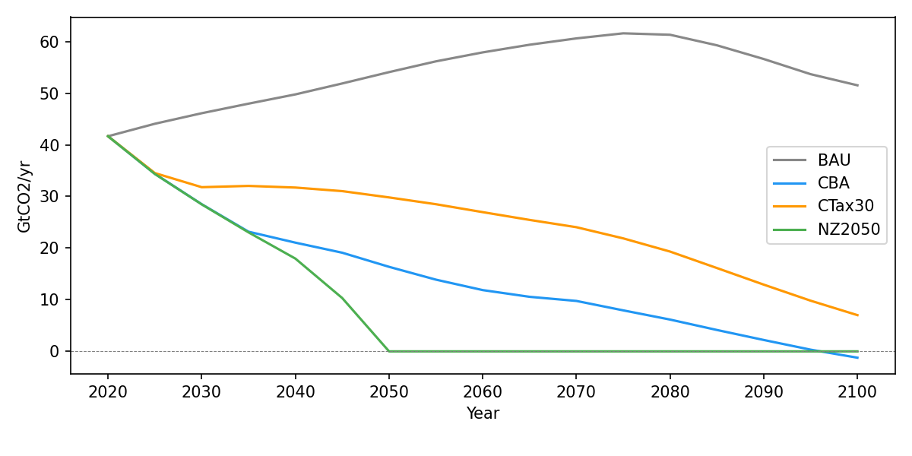

# PyDICE32 v0.7.0

Python/GAMSPy port of the [RICE50x](https://github.com/witch-team/RICE50xmodel) integrated assessment model, re-aggregated to 32 GCAM v8+ regions.

## Overview

PyDICE32 is a partial translation of the GAMS-based RICE50x model into Python using [GAMSPy](https://gamspy.readthedocs.io/). The model aggregates 155 ISO3 countries into 32 [GCAM v8+](https://jgcri.github.io/gcam-doc/) regions.

**This is not a literal 1:1 port.** The core economy-emissions-welfare-abatement stack is closely translated, but optional modules have varying fidelity and several source branches are not yet implemented. See the [Coverage](#coverage) section for details.



*Global CO2 emissions under 4 policy scenarios (Kalkuhl damages, prob50 MACC). CTax30 uses ctax_marginal=True ($30/tCO2, 3%/yr growth). NZ2050 reaches net-zero at 2050; CBA finds the welfare-optimal path.*

## Features

### Policies (11)
| Policy | Description |
|--------|-------------|
| `bau` | Business-as-usual, no climate policy |
| `bau_impact` | BAU with climate damages computed |
| `cba` | Cost-benefit analysis (optimal mitigation) |
| `cbudget` | Cumulative CO2 budget (e.g., 1150 GtCO2 for ~2°C) |
| `cbudget_regional` | Regional carbon budgets with burden sharing |
| `cea_tatm` | Temperature ceiling (e.g., 2°C from 2100) |
| `cea_rcp` | Radiative forcing ceiling |
| `ctax` | Carbon tax with exponential growth schedule |
| `global_netzero` | Global net-zero CO2 by target year |
| `long_term_pledges` | Per-country net-zero pledges (Paris Agreement) |
| `simulation` | Fixed MIU=0, no mitigation |

### Damage Functions (7)
- **DICE** — Nordhaus (2018) quadratic temperature-level damages
- **Kalkuhl** — Kalkuhl & Wenz (2020) growth-rate damages (simple + full omega)
- **Burke** — Burke, Hsiang & Miguel (2015) with sr/lr/srdiff/lrdiff specifications
- **Howard** — Howard & Sterner (2017) meta-analysis quadratic damages
- **Dell** — Dell, Jones & Olken (2012) growth-rate with rich/poor differentiation
- **COACCH** — van der Wijst et al. (2023) regional polynomial with quantile uncertainty
- **CLIMCOST** — EU CLIMCOST project (uses COACCH module with different coefficients)

### Climate Modules (3 of 4 source modules)
- **WITCH-CO2** — 3-box carbon cycle with 2-layer temperature
- **FAIR** — Impulse response model with 20 equations (Smith et al., 2018)
- **tatm_exogen** — Exogenous temperature path simulation (via `cfg.tatm_exogen_path`)

Not implemented: `witchghg` (multi-GHG WITCH).

### Social Welfare Functions (3)
- **Disentangled** — Berger & Emmerling (2020) equity-equivalents (default)
- **DICE** — Original DICE SWF with Negishi weights
- **Stochastic** — Branch-node probability tree with ambiguity aversion

### Multi-GHG
CO2, CH4, N2O with species-specific:
- Carbon intensity (sigma) from SSP scenarios
- Marginal abatement cost curves (MACC) with backstop calibration
- Global warming potential (GWP) conversion
- Emission quantity/cost unit conversion (convq_ghg, convy_ghg)

### Solve Modes
- **Single-pass** — Fast cooperative optimization
- **Cooperative iterative** — Multi-iteration with Negishi weight updates, DAC learning (default for non-BAU)
- **Nash non-cooperative** — Per-region best-response with convergence tracking

Note: `coalitions` mode requires user-defined `coalition_def` (dict or JSON file via `--coalition-def`). GAMS preset coalition files are not ported. Without `coalition_def`, falls back to `noncoop`.

### Extension Modules
| Module | Status | Description |
|--------|--------|-------------|
| DAC + CCS Storage | translated | Direct air capture with learning curve, per-type CCS storage, cumulative tracking, leakage |
| SAI | partial | g0 uniform + g6 emulator; `can_deploy` gate implemented, `sovereign`/`eqsym_sai` not yet |
| Adaptation | translated | CES-nested adaptive capacity with per-region exponents and OMEGA>0 gate |
| Ocean | translated | Coral, mangrove, fisheries ecosystem services; VSL/mangrove use YNET.l pattern |
| Natural capital | partial | Production function path implemented; `nat_cap_prodfun` TFP branch not yet ported |
| Inequality | partial | Core decile accounting; `transfer="opt"` and `omegacalib` paths not yet ported |
| Sea-level rise | translated | Thermal expansion + ice sheet dynamics |
| Labour | stub | Not implemented |

### Source Modules Not Ported
| Source module | Notes |
|---------------|-------|
| `mod_climate_witchghg` | Multi-GHG WITCH climate (FAIR covers same functionality) |
| `mod_impact_sai` | SAI-specific Burke+Kotz+precipitation damage function |
| `mod_emission_pulse` | GAMS-style SCC module (replaced by `scc.py` Python implementation) |

## Installation

### Requirements
- Python 3.10+
- [GAMSPy](https://gamspy.readthedocs.io/) with GAMS license
- NumPy, Pandas

### Setup
```bash
conda create -n pydice32 python=3.11
conda activate pydice32
pip install gamspy numpy pandas
```

### Data
PyDICE32 reads CSV data from the RICE50x model directory. Ensure this structure exists:
```
rice-fund-gcam/
├── pydice32/              # this package
├── RICE50xmodel/
│   └── data_maxiso3_csv/  # CSV exports of GAMS GDX data
└── gcam-core/
    └── input/gcamdata/inst/extdata/common/
        ├── iso_GCAM_regID.csv
        └── GCAM_region_names.csv
```

## Usage

### Command Line
```bash
# Basic scenarios
python -m pydice32 bau --dice
python -m pydice32 cba --dice
python -m pydice32 cba --kalkuhl

# Carbon budget (2°C and 1.5°C)
python -m pydice32 cbudget --dice --cbudget=1150
python -m pydice32 cbudget --dice --cbudget=500

# Temperature ceiling
python -m pydice32 cea_tatm --dice --tatm-limit=2.0

# Carbon tax
python -m pydice32 ctax --dice --ctax-initial=50 --ctax-slope=0.05

# Net-zero
python -m pydice32 global_netzero --dice --nz-year=2050

# With options
python -m pydice32 cba --dice --prstp=0.03 --macc=prob75

# Iterative cooperative solve
python -m pydice32 cba --dice --iterative

# Nash non-cooperative
python -m pydice32 cba --dice --noncoop
```

### Batch Scenarios
```bash
# Run 30 scenarios (5 policies × 2 damage functions × 3 MACC costs)
python -m pydice32.batch_run
```
Results saved to `pydice32/results/`.

### Python API
```python
from pydice32.config import Config
from pydice32.solver import build_model, solve_model
from pydice32.report import print_results

cfg = Config(policy="cba", impact="dice", PRSTP=0.015)
m, rice, v, data = build_model(cfg)
solve_model(rice, cfg)
print_results(m, rice, cfg, v, data)
```

## Architecture

```
pydice32/
├── config.py                  # All parameters in one dataclass
├── solver.py                  # Model assembly + single-pass/iterative/Nash solve
├── report.py                  # Result extraction and printing
├── batch_run.py               # Multi-scenario batch runner
├── batch_run_reuse.py         # Batch runner with MACC reuse (build once per family)
├── data/
│   ├── loader.py              # CSV I/O utilities
│   ├── gcam_mapping.py        # 155 ISO3 → 32 GCAM region aggregation
│   ├── calibration.py         # TFP, savings, sigma, MACC, climate parameters
│   └── sai_emulator_data.py   # SAI g6 regional response synthesis
└── modules/                   # Translated from GAMS .gms files (see Coverage)
    ├── core_economy.py        # Cobb-Douglas production, capital, consumption
    ├── core_emissions.py      # Multi-GHG emissions with MIU inertia
    ├── core_abatement.py      # MACC polynomial cost curves
    ├── core_welfare.py        # Disentangled / DICE / Stochastic SWF
    ├── core_policy.py         # 11 policy constraints + NDC (merged from pol_ndc.gms)
    ├── hub_climate.py         # WITCH-CO2 carbon cycle + temperature
    ├── hub_impact.py          # Damage fraction with cap, adaptation, SLR
    ├── mod_climate_fair.py    # FAIR impulse response
    ├── mod_climate_regional.py # Regional temp + precip downscaling
    ├── mod_impact_dice.py     # DICE quadratic damage
    ├── mod_impact_kalkuhl.py  # Kalkuhl growth-rate damage + full omega
    ├── mod_impact_burke.py    # Burke level damage + differentiated specs
    ├── mod_landuse.py         # Land-use emissions and abatement
    ├── mod_dac.py             # Direct air capture with learning
    ├── mod_emi_stor.py        # CCS storage (per-type, cumulative, leakage)
    ├── mod_sai.py             # SAI geoengineering (g0 + g6)
    ├── mod_adaptation.py      # CES adaptive capacity
    ├── mod_ocean.py           # Ocean ecosystem services
    ├── mod_natural_capital.py # Natural capital in production + utility
    ├── mod_inequality.py      # Decile income distribution
    ├── mod_slr.py             # Sea-level rise components
    └── mod_labour.py          # Labour market (stub)
```

Each module follows a two-pass pattern mirroring GAMS phases:
1. `declare_vars()` — Create variables, set bounds and starting values
2. `define_eqs()` — Create equations referencing cross-module variables

## Coverage

Translation fidelity relative to [RICE50xmodel](https://github.com/witch-team/RICE50xmodel):

| Category | Status |
|----------|--------|
| Core economy/emissions/welfare/abatement | Closely translated |
| Policies (11 modes) | Translated; fiscal revenue approach active by default (GAMS-aligned) |
| DICE/Kalkuhl/Burke damage functions | Translated |
| WITCH-CO2 climate | Translated (merged into hub_climate) |
| FAIR climate | Translated; FF_CH4 endogenous, o3trop emissions terms included |
| Regional climate downscaling | Translated (temp + precip) |
| DAC + CCS Storage | Translated (per-type storage, leakage) |
| SAI | Partial (g0/g6 work; `sovereign`/`eqsym_sai` missing) |
| Adaptation | Translated (per-region CES exp, OMEGA>0 gate) |
| Ocean | Translated (YNET.l pattern for VSL/mangrove) |
| Sea-level rise | Translated |
| Natural capital | Partial (`nat_cap_prodfun` TFP branch missing) |
| Inequality | Partial (`transfer="opt"`, `omegacalib` missing) |
| Cooperation: coop/noncoop | Translated |
| Cooperation: coalitions | Partial (user-defined coalition_def; no GAMS preset library) |
| tatm_exogen, dell, howard, coacch, climcost, deciles | Translated |
| SCC (emission_pulse) | Translated (Python `scc.py`, not GAMS module) |
| WITCH-GHG, mod_impact_sai | Not implemented |

## Default Differences from GAMS

| Setting | GAMS default | PyDICE32 default | Reason |
|---------|-------------|------------------|--------|
| `climate` | `fair` | `witchco2` | Simpler default for initial testing |
| `cooperation` | `noncoop` | `coop` | Single-pass cooperative is faster |
| `ctax_marginal` | OFF (commented out) | `False` (aligned) | Fiscal revenue approach |
| `sai_experiment` | `g6` | `g6` (aligned) | |
| `sai_start` | 2035 | 2035 (aligned) | |
| `can_deploy` | `no` | `no` (aligned) | |
| `nat_cap_utility` | OFF | `False` (aligned) | |

## Batch Mode with MACC Reuse

For scenarios differing only in `macc_costs` (prob25/prob50/prob75), `batch_run_reuse.py` builds the GAMSPy model once per policy/impact family and swaps MACC parameters via `setRecords()` for re-solve with warm start.

Measured performance (ctax + kalkuhl family, 3 MACC variants):
- Fresh build+solve: ~137s
- MACC swap+re-solve: ~6-9s each (warm start)
- 3-run family total: ~152s vs ~411s naive (63% reduction)

```bash
python -m pydice32.batch_run_reuse
```

## References

- Emmerling, J., et al. (2024). RICE50x: The RICE50+ Integrated Assessment Model. [GitHub](https://github.com/witch-team/RICE50xmodel)
- Nordhaus, W. (2018). Projections and Uncertainties about Climate Change in an Era of Minimal Climate Policies. *AEJ: Economic Policy*, 10(3), 333-360.
- Kalkuhl, M. & Wenz, L. (2020). The impact of climate conditions on economic production. *Journal of Environmental Economics and Management*, 103, 102360.
- Burke, M., Hsiang, S. & Miguel, E. (2015). Global non-linear effect of temperature on economic production. *Nature*, 527, 235-239.
- Smith, C.J., et al. (2018). FAIR v1.3: A simple emissions-based impulse response and carbon cycle model. *Geoscientific Model Development*, 11, 2273-2297.
- Berger, L. & Emmerling, J. (2020). Welfare as Equity Equivalents. *Journal of Economic Surveys*, 34(4), 727-752.

## License

This project is licensed under the GNU General Public License v3.0 — see [LICENSE](LICENSE) for details.
